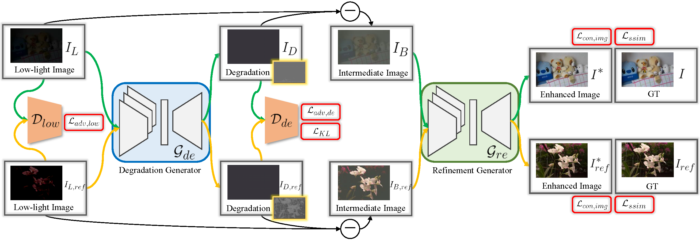

# Degrade is Upgrade: Learning Degradation for Low-light Image Enhancement

This package contains the Python implementation of "[Degrade is Upgrade: Learning Degradation for Low-light Image Enhancement](https://arxiv.org/pdf/2103.10621.pdf)"

## Abstract
Low-light image enhancement aims to improve an image's visibility while keeping its visual naturalness. Different from existing methods, which tend to accomplish the enhancement task directly, we investigate the intrinsic degradation and relight the low-light image while refining the details and color in two steps. Inspired by the color image formulation (diffuse illumination color plus environment illumination color), we first estimate the degradation from low-light inputs to simulate the distortion of environment illumination color, and then refine the content to recover the loss of diffuse illumination color. To this end, we propose a novel Degradation-to-Refinement Generation Network (DRGN). Its distinctive features can be summarized as 1) A novel two-step generation network for degradation learning and content refinement. It is not only superior to one-step methods, but also is capable of synthesizing sufficient paired samples to benefit the model training; 2) A multi-resolution fusion network to represent the target information (degradation or contents) in a multi-scale cooperative manner, which is more effective to address the complex unmixing problems. Extensive experiments on both the enhancement task and the joint detection task have verified the effectiveness and efficiency of our proposed method, surpassing the SOTA by 0.95dB in PSNR on LOL1000 dataset and 3.18\% in mAP on ExDark dataset. The code will be available soon.

## DRGN
<p align="center">
  
</p>
\caption{Architecture of Degradation-to-Refinement Generation Network (DRGN). It consists of two subnetworks to tackle degradation estimation and content refinement, respectively. A degradation generator (DeG) learns degradation $I_{D}$ from the low-light input $I_{L}$ in the first stage, and produces the base enhanced result $I_B$ by removing $I_{D}$. Then, a refinement generator (ReG) takes $I_B$ as input and produces the refined prediction ($I^{*}$) of the normal-light image ($I$). We also apply DeG to generate the synthetic paired samples $[I_{L,ref}, I_{ref}]$ to augment the sample space to help train these two generators.
}

## Results
### Qualitative Results
<p align="center">
  
</p>
<p align="center">
  
</p>

## BibTeX
```
 @InProceedings{kui2021DRGN,
        author = {Kui Jiang, Zhongyuan Wang, Zheng Wang, Peng Yi, Xiao Wang, Yansheng Qiu, Chen Chen, Chia-Wen Lin},
        title = {Degrade is Upgrade: Learning Degradation for Low-light Image Enhancement},
        booktitle = {arXiv},
        month = {March},
        year = {2021}
    }
```

